<link rel="stylesheet" href="override-markdown-styles.css"/>

---

<a name="page_1" class="page-number">1</a>

---

This light weight rules resource for *Gloomhaven: Buttons & Bugs* is intended to be easy to access, search, and print. It is updated with any corrections and errata.

Last updated 11/09/2023

For more resources, visit [cephalofair.com/bnb](https://cephalofair.com/bnb)

© 2023 Cephalofair Games, LLC. All Rights Reserved.

---

<a href="#page_1">🔝</a>&nbsp; &nbsp;<a name="page_2" class="page-number">2</a>

---

# Table of Contents

<h3 id="getting-started-p3">Getting Started <a href="#page_3">p.3</a></h3>

<ul>
  <li>Choose a Character <a href="#page_4">p.4</a></li>
  <li>Learning the Rules <a href="#page_5">p.5</a></li>
</ul>

<h3 id="scenario-phase-p6">Scenario Phase <a href="#page_6">p.6</a></h3>

<h4 id="beginning-a-scenario-p7">Beginning a Scenario <a href="#page_7">p.7</a></h4>

<h4 id="scenario-cards-p8">Scenario Cards <a href="#page_8">p.8</a></h4>

<ul>
  <li>Terrain <a href="#page_9">p.9</a>
    <ul>
      <li>Obstacles <a href="#page_9">p.9</a></li>
      <li>Difficult Terrain <a href="#page_9">p.9</a></li>
      <li>Hazards <a href="#page_9">p.9</a></li>
      <li>Pressure Plates <a href="#page_9">p.9</a></li>
      <li>Objectives <a href="#page_9">p.9</a></li>
    </ul>
  </li>
</ul>

<h4 id="playing-a-scenario-p10">Playing a Scenario <a href="#page_10">p.10</a></h4>

<ol>
  <li>Start of Round Effects <a href="#page_10">p.10</a></li>
  <li>Card Selection <a href="#page_10">p.10</a></li>
  <li>Ordering of Initiative <a href="#page_11">p.11</a>
    <ul>
      <li>Resolving Ties <a href="#page_11">p.11</a></li>
      <li>Monster Order <a href="#page_11">p.11</a></li>
    </ul>
  </li>
  <li>Character and Monster Turns <a href="#page_12">p.12</a>
    <ul>
      <li>Actions and Abilities Overview <a href="#page_12">p.12</a>
        <ul>
          <li>Actions <a href="#page_12">p.12</a></li>
          <li>Abilities <a href="#page_12">p.12</a></li>
        </ul>
      </li>
      <li>Important Ability Concepts <a href="#page_13">p.13</a>
        <ul>
          <li>Target <a href="#page_13">p.13</a></li>
          <li>Allies, Enemies, and Self <a href="#page_13">p.13</a></li>
          <li>Range <a href="#page_14">p.14</a></li>
          <li>Area of Effect <a href="#page_14">p.14</a></li>
          <li>Added Effects <a href="#page_15">p.15</a></li>
          <li>Elements <a href="#page_16">p.16</a></li>
        </ul>
      </li>
      <li>Abilities <a href="#page_17">p.17</a>
        <ul>
          <li>Move <a href="#page_17">p.17</a>
            <ul>
              <li>Jump <a href="#page_17">p.17</a></li>
              <li>Flying <a href="#page_17">p.17</a></li>
            </ul>
          </li>
          <li>Attack <a href="#page_18">p.18</a>
            <ul>
              <li>Attack Modification Order <a href="#page_18">p.18</a></li>
              <li>Attack Modifier Tables <a href="#page_18">p.18</a></li>
              <li>Attack Effects <a href="#page_19">p.19</a></li>
              <li>Advantage and Disadvantage <a href="#page_19">p.19</a></li>
              <li>Pierce <a href="#page_19">p.19</a></li>
            </ul>
          </li>
          <li>Conditions <a href="#page_20">p.20</a>
            <ul>
              <li>Positive Conditions <a href="#page_20">p.20</a></li>
              <li>Negative Conditions <a href="#page_20">p.20</a></li>
            </ul>
          </li>
          <li>Heal <a href="#page_21">p.21</a></li>
          <li>Active Bonuses <a href="#page_21">p.21</a>
            <ul>
              <li>Shield <a href="#page_22">p.22</a></li>
              <li>Retaliate <a href="#page_22">p.22</a></li>
            </ul>
          </li>
          <li>Forced Movement <a href="#page_23">p.23</a></li>
          <li>Control <a href="#page_24">p.24</a></li>
          <li>Suffer Damage <a href="#page_24">p.24</a></li>
          <li>Recover <a href="#page_24">p.24</a></li>
        </ul>
      </li>
      <li>Character Turns <a href="#page_25">p.25</a>
        <ul>
          <li>Ability Cards <a href="#page_25">p.25</a></li>
          <li>Items <a href="#page_26">p.26</a>
            <ul>
              <li>Item Limits <a href="#page_26">p.26</a></li>
              <li>Item Usage <a href="#page_26">p.26</a></li>
            </ul>
          </li>
          <li>Mandatory Triggers <a href="#page_27">p.27</a></li>
          <li>Resting <a href="#page_27">p.27</a></li>
          <li>Lost Actions <a href="#page_28">p.28</a></li>
          <li>Character Damage <a href="#page_28">p.28</a></li>
          <li>Exhaustion <a href="#page_28">p.28</a></li>
        </ul>
      </li>
      <li>Monster Turns <a href="#page_29">p.29</a>
        <ul>
          <li>Monster Cards <a href="#page_29">p.29</a></li>
          <li>Monster Acting Order <a href="#page_30">p.30</a></li>
          <li>Focus <a href="#page_30">p.30</a>
            <ul>
              <li>Path Priority <a href="#page_30">p.30</a></li>
              <li>No Focus <a href="#page_30">p.30</a></li>
            </ul>
          </li>
          <li>Monster Movement <a href="#page_31">p.31</a></li>
          <li>Monster Attacks <a href="#page_31">p.31</a></li>
          <li>Other Monster Abilities <a href="#page_31">p.31</a></li>
          <li>Monsters and Elements <a href="#page_32">p.32</a></li>
          <li>Spawning Monsters <a href="#page_32">p.32</a></li>
          <li>Monster Damage and Death <a href="#page_32">p.32</a></li>
        </ul>
      </li>
      <li>End of Round <a href="#page_33">p.33</a>
        <ul>
          <li>Tracking Rounds <a href="#page_33">p.33</a></li>
        </ul>
      </li>
    </ul>
  </li>
</ol>

<h3 id="ending-a-scenario-p34">Ending a Scenario <a href="#page_34">p.34</a></h3>

<ul>
  <li>Lost Scenario <a href="#page_34">p.34</a></li>
  <li>Completed Scenario <a href="#page_34">p.34</a></li>
</ul>

<h3 id="the-adventure-begins-p35">The Adventure Begins <a href="#page_35">p.35</a></h3>

<ul>
  <li>Item Supplies <a href="#page_35">p.35</a></li>
  <li>Character Progression <a href="#page_35">p.35</a></li>
  <li>Upgraded Ability Cards <a href="#page_35">p.35</a></li>
</ul>

<h3 id="appendices">Appendices</h3>

<ul>
  <li>Appendix A: Component Inventory <a href="#page_36">p.36</a></li>
  <li>Appendix B: Monster Turn Guide <a href="#page_37">p.37</a></li>
  <li>Appendix C: Important Reminders <a href="#page_38">p.38</a></li>
  <li>Appendix D: Item Index <a href="#page_39">p.39</a></li>
  <li>Appendix E: Index <a href="#page_40">p.40</a></li>
</ul>

<h3 id="credits-p41">Credits <a href="#page_41">p.41</a></h3>

<h3 id="quick-reference-p42">Quick Reference <a href="#page_42">p.42</a></h3>

---

<a href="#page_1">🔝</a>&nbsp; &nbsp;<a name="page_3" class="page-number">3</a>

---

# Getting Started

Oh no! You have been shrunk by magic! To return to your former size, you’ll need to navigate this strange new world by playing through a series of scenarios that will lead you through the miniature world you now find yourself in. You may find a few friends along the way, but you’ll mostly meet a variety of enemies you will need to defeat in combat. Luckily, you are a capable mercenary with abilities, which are represented by cards. You’ll need to play the right cards at the right times to overcome the many threats that await you on your journey.

There are six character classes to choose from, each with their own unique abilities and play styles. You will also be able to customize your character as you progress through items and advanced ability cards.

This document will provide you with details on how to play the game, but if you played another Gloomhaven game, many of these rules will be familiar. We suggest reading all the way through anyways to get a full understanding of how the game works. Rules text highlighted in lavender is information unique to the Buttons & Bugs system and is different from Gloomhaven and Frosthaven.

---

<a href="#page_1">🔝</a>&nbsp; &nbsp;<a name="page_4" class="page-number">4</a>

---

## Choose a Character

Creating a character and starting your journey in Buttons & Bugs is a simple process: you just choose a character class and start playing.

You will need to gather the following components for your chosen character to play:

- **Character Card:** This card provides a visual representation of your character, along with your hit point values at different levels and a place to put condition tokens. On the back, you can find a short description of the character and a list of your ability cards and upgrades.
- **Character Mini:** This is a small plastic piece to represent your character.
- **Ability Cards:** There are four double-sided level 1 cards and four double-sided level 2 cards. The appropriate cards are listed on your character card.
- **Attack Modifier Tray (with white cube):** This is used to track your attack modifier table. At level 1, you will use the default table printed on the tray.
- **Advanced Attack Modifier Cards:** Two double-sided cards to upgrade your attack modifier table at later levels.
- **Character Hit Point Dial:** This is to track your hit points during a scenario.

---

<a href="#page_1">🔝</a>&nbsp; &nbsp;<a name="page_5" class="page-number">5</a>

---

## Learning the Rules

Now that you’ve chosen a character, it is time to learn the rules. If you would prefer to watch a video instead, you can find that here:

[cephalofair.com/bnb](https://cephalofair.com/bnb)

Most of the rules of this game focus on how you play through a scenario. Since this is intended to be a campaign game, where you play through a series of scenarios in order, there will be some explanation of how to do that after the basic rules.

---

<a href="#page_1">🔝</a>&nbsp; &nbsp;<a name="page_6" class="page-number">6</a>

---

# Scenario Phase

Scenarios are self-contained missions designed to be played in a single sitting. The scenario deck contains 20 scenarios, but you will not play through them all in a single campaign. Unlike other Gloomhaven games, the story of Buttons & Bugs is mostly linear.

Each Scenario Phase consists of three distinct steps:

- **Beginning a Scenario:** In this step, you will prepare everything needed for the scenario, including your own character, the monsters you will fight against, and the map layout where the fight will occur.
- **Playing a Scenario:** The scenario is played over a series of rounds. During each round, all figures on the map, both your character and the monsters, will take a turn. You will play through round after round until the scenario is lost or completed.
- **Ending a Scenario:** In this step, you will resolve the effects of losing or completing the scenario.

---

<a href="#page_1">🔝</a>&nbsp; &nbsp;<a name="page_7" class="page-number">7</a>

---

> # Beginning a Scenario
> 
> Each time you play a scenario, you will prepare the scenario by performing the following steps in order:
>
> 1. Select a scenario to play and find the corresponding scenario card. **Note:** You can play any scenario, but for the best story experience, we suggest that you follow the conclusion text of each scenario.
> 1. Read the scenario introduction, special rules, and goal in the scenario entry and check the scenario level.
> 1. Retrieve the monster card for each monster type present in the scenario.
> 1. Resolve any scenario effects or note them to be resolved later in setup. Flip the scenario card to its map side.
> 1. Place each monster card in its own monster tray. For each tray, place one white cube on the tray’s “o” slot. Retrieve the monster hit point dial colored to correspond to each monster on the scenario map. 
> 1. Place uniquely colored cubes on the map to represent each monster in the scenario, matching the color shown on the scenario map. Place your character mini on the indicated starting space.
> 1. Retrieve both attack modifier trays. If the scenario is level 2 or higher, retrieve the appropriate level modifier card for your character and place it in the character modifier tray. You may select a monster difficulty other than “standard” by placing the chosen difficulty monster modifier card in the monster modifier tray.
> 1. Keep all condition tokens, the die, and the icon reference card nearby.
> 1. Decide which items to equip from the pool of available items (see [p.26](#page_26)).
> 1. Retrieve your character’s level 1 ability cards and select a number of cards to upgrade equal to the scenario level minus one. Replace the selected level 1 ability cards with the corresponding level 2 ability cards (listed on the back of your character card). Your selected cards will start in your hand.
> 1. Set the character hit point dial to your character’s maximum hit point value, which is shown below the scenario level in the chart at the bottom of your character card. Set each monster’s corresponding colored hit point dial to their respective maximum hit points.
> 1. Apply any remaining scenario effects.

---

<a href="#page_1">🔝</a>&nbsp; &nbsp;<a name="page_8" class="page-number">8</a>

---

> ## Scenario Cards
> 
> Each card contains a scenario entry with everything you need to know to play through it. Most scenario entries contain the following information:

<blockquote>
  <ol type="A">
    <li>The scenario’s number, name, and level.</li>
    <li>The character required to play the scenario, if any.</li>
    <li>The narrative introduction to the scenario.</li>
    <li>The list of monsters that appear in the scenario.</li>
    <li>The goal of the scenario. When this is achieved, the scenario is completed, and the scenario conclusion should be read at the end of the current round.</li>
    <li>Any special rules for the scenario.</li>
    <li>The narrative conclusion to the scenario.</li>
    <li>The scenario or scenarios to be played next in the campaign.</li>
  </ol>
</blockquote>

> The map side of each scenario card also displays the map details for the scenario. This includes the following information:

<blockquote>
  <ol type="A">
    <li><strong>Starting Hex:</strong> You place your miniature in this hex at the start of the scenario.</li>
    <li><strong>Terrain:</strong> These are hexes indicating additional map features (see <a href="#page_9">p.9</a>).</li>
    <li><strong>Monster Placements:</strong> These hexes show monster placements. Place each monster cube in the hex showing the corresponding cube color.</li>
    <li><strong>Notable Hexes:</strong> These hexes, marked by letters, are explained in the special rules of the scenario.</li>
  </ol>
</blockquote>

---

<a href="#page_1">🔝</a>&nbsp; &nbsp;<a name="page_9" class="page-number">9</a>

---

### Terrain

Each scenario map contains various types of terrain. The type of terrain is defined by the colored border of the tile, as depicted on the scenario map, not necessarily by the illustration of the hex.
A hex with no terrain outline is considered **featureless**. A hex with no figure is considered **unoccupied**. A hex that is both featureless and unoccupied is considered **empty**.

#### Obstacles

  
  
Figures cannot enter a hex with an obstacle, except when flying or jumping (unless the jump movement would end there). Range can be counted through obstacles, and obstacles do not block ranged attacks.

#### Difficult Terrain

  
  
A figure requires 2 movement points to enter a difficult terrain hex, except when flying or jumping (even if the jump movement ends there).

> #### Hazards

<blockquote>
  

    
    
If any figure enters a hazard hex, unless they are flying or jumping, some effect is applied to that figure. Hazard effects are varied and are specified by each individual hazard on the scenario map. Figures do not suffer additional effects when starting a turn in or exiting a hazard hex, but the effects are applied if you end a jump movement in a hazard hex. If a figure occupies a hex with an <strong>immobilize</strong>  hazard (see p.20), treat them as an obstacle when determining the movement of other figures.

  

</blockquote>

#### Pressure Plates

  
  
A pressure plate’s trigger and all of its effects are defined in the special rules for the scenario. Pressure plates are considered empty hexes.

> #### Objectives

<blockquote>
  

    
    
An objective, when present, is important to the goal of a scenario; an objective is a physical object (such as a bell) which needs to be attacked or protected. Objectives can be targeted by attacks, but are immune to damage, all conditions, and forced movement. Objectives are otherwise considered to be and treated as obstacles. The special rules for the scenario will describe how the objective relates to the scenario’s goal.

  

</blockquote>

---

<a href="#page_1">🔝</a>&nbsp; &nbsp;<a name="page_10" class="page-number">10</a>

---

# Playing a Scenario

Once a scenario is set up, you are ready to play! Each scenario is played in a series of rounds, and each round consists of the following steps:
1. Start of Round Effects
1. Card Selection
1. Ordering of Initiative
1. Character and Monster Turns
1. End of Round
These rounds continue until the scenario goal is reached. 

## Start of Round Effects

Apply any start of round effects from the scenario rules, such as spawning monsters. These effects can be applied in any order, though all spawning should happen at the same time (see [p.32](#page_32)).

## Card Selection

After all start-of-round effects are applied, select two ability cards from your hand to play this round. Of the two cards, one should be selected as the initiative card. The initiative value at the center of that card will determine your position in the initiative order (see [p.11](#page_11)).

Alternatively, if you have at least two cards in your hand and/or discard pile, you can instead declare a long rest at this time (see [p.27](#page_27)). You will perform your long rest on initiative 99 as your entire turn for the round and will not play any cards.

---

<a href="#page_1">🔝</a>&nbsp; &nbsp;<a name="page_11" class="page-number">11</a>

---

## Ordering of Initiative

After you have selected two ability cards or declared a long rest, determine the monster initiatives and actions for the round. For each monster type that has at least one monster on the board, roll the die and move the white cube to the action indicated by the die result.

Determine the initiative order by comparing the initiative values on your initiative card and all rolled monster actions (located at the top of the column). This indicates the turn order for this round, going from lowest initiative value to highest. If you are long resting, you have an initiative of 99. 

### Resolving Ties

If there is a tie in initiative between you and a monster, you act first.

### Monster Order

Each monster takes its turn based on initiative order. All monsters of a single type take their turns at the same initiative in ascending numeric order (see [p.30](#page_30)).

---

<a href="#page_1">🔝</a>&nbsp; &nbsp;<a name="page_12" class="page-number">12</a>

---

## Character and Monster Turns

Every figure on the map — both you and monsters — will get a turn each round. A figure’s turn starts when the previous figure ends their turn and concludes when the next figure begins theirs. During a figure’s turn, they will perform the actions and abilities on their cards.

Before we tackle the specifics of character and monster turns, we need to go over how actions and abilities work.

### Actions and Abilities Overview

#### Actions

An **action** is a set of one or more abilities, which are detailed on one half of an ability card. You will normally perform two actions on your turn: the top action of one of your played ability cards and the bottom action of the other. An entire half of an ability card is considered a single action.

Monsters will perform one action on their turn. The entire column of abilities is a single action.

An action can be referred to by any of its abilities. For example, if an action contains both a " **2**" ability and an "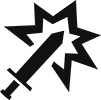 **2**" ability, it can be referred to as both a move action and an attack action.

#### Abilities

An **ability** is any grouping of text and/or icons (often found on an ability card or monster action) that a figure can perform to interact with the map, themselves, or other figures.

If an action consists of multiple abilities, these will be separated from each other by ability lines.

Abilities in an action are always performed in the order they are written. Figures cannot perform new abilities while resolving a different ability, with the exception of abilities from attack modifiers.

Character abilities can be skipped, unless they are mandatory (see [p.27](#page_27)).

---

<a href="#page_1">🔝</a>&nbsp; &nbsp;<a name="page_13" class="page-number">13</a>

---

### Important Ability Concepts

#### Target

 Most abilities target one or more figures. Target specifies what kind of figure or how many figures an ability affects. The requirements for the target are sometimes written out, but often will simply be a number. "**Target X**" allows the acting figure to target up to X different figures within the ability’s range. Targeting and range restrictions, as well as additional effects of the ability, apply to all targets. It is not possible to target the same figure multiple times with the same ability, unless otherwise stated.

If no target is specified on a targeted ability, the target value is 1, which means it only targets a single figure.

#### Targeted Abilities

Attack ([p.18](#page_18)), conditions ([p.20](#page_20)), heal ([p.21](#page_20)), forced movement ([p.23](#page_23)), and controlling figures ([p.24](#page_24)) are the only targeted abilities. Targeted abilities cannot be performed if there is no valid target.

#### Allies, Enemies, and Self

Monsters are allies to other monsters, and you and monsters are enemies to each other. **Figures are not their own allies.**

In general, negative abilities can only target enemies, and positive abilities can only target allies or the acting figure. However, some abilities have specific targeting information that contradicts this rule.

If any ability specifies the target as "self," the effect can only be applied to the acting figure.

---

<a href="#page_1">🔝</a>&nbsp; &nbsp;<a name="page_14" class="page-number">14</a>

---

#### Range

 Most abilities target a figure. Range indicates how far away that figure can be. "**Range X**" means the acting figure can target any figure within X hexes, including the acting figure. Range can be counted through obstacles and figures.

Any ability with a range value specified in the highlighted section to its right is considered a ranged ability.

Figures treat the hex they occupy as adjacent for the purpose of targeting.

#### Area of Effect

Abilities with an area of effect allow the acting figure to target multiple hexes at the same time. Rotating and mirroring the depicted area of effect is permitted.

  
  
Gray indicates the hex which the acting figure occupies. Any attack with an area of effect that includes a gray hex is always considered a melee attack (see <a href="#page_18">p.18</a>).

  
  
Red indicates the hexes in which figures can be targeted. Only one red hex needs to be within the ability’s range. This initial hex does not need to contain a figure.

If an ability with an area of effect gains "**+1** ," an additional figure within the ability’s range, but outside the area of effect, can be targeted. This does not mean that the entire area of effect can be applied again, however; only one additional hex may be targeted.

---

<a href="#page_1">🔝</a>&nbsp; &nbsp;<a name="page_15" class="page-number">15</a>

---

#### Added Effects

Added effects are attached to an ability and modify it in some way. Common added effects like " **X**," " **X**," or conditions are usually listed in a highlighted section to the right of the ability. All conditional effects — those dependent on consuming an element (see [p.16](#page_16)) or paying some other cost — are listed below the ability in a highlighted section with a dotted line border.

Added effects can be skipped, but you must choose to do so before rolling an attack modifier. Conditional effects can also be skipped; you are not required to pay the cost and, even if you do, you may still choose not to apply the effect. In the case of a skippable effect attached to a multi-target attack ability, you may skip the effect on an attack-by-attack basis, in each case choosing before rolling an attack modifier, unless otherwise stated.

More complex added effects might be written below the ability, but not all text below an ability is an added effect. Any text that provides rules for how the ability is performed (e.g., a targeting restriction) is an inherent part of the ability, not an added effect, and cannot be skipped.

---

<a href="#page_1">🔝</a>&nbsp; &nbsp;<a name="page_16" class="page-number">16</a>

---

> #### Elements
> 
> Some actions have an elemental affinity associated with them (fire, ice, air, earth, light, or dark). Element infusions on your played ability cards, ability cards in your hand and active area, as well as element infusions on rolled monster actions, are each available to be consumed once each round. Multiple infusions of the same element can be available to be consumed in the same round.
> 
> |  |  |  |  |  |  |
> | Fire | Ice | Air | Earth | Light | Dark |
> 
> An infused element is available as long as it is visible and has not yet been consumed in the current round (mandatory). An infused element on an ability card is no longer available once that card is discarded, lost, or flipped to its other side. When an ability card is flipped to its B-side or recovered to your hand, the infused element on the visible side of that card becomes available. Only one instance of an infused element on a rolled monster action is available, even if multiple enemies of that type are on the board. An infused element on a rolled monster action is no longer available once all monsters of that type are killed.
> 
> Infused elements can be consumed to add effects to certain abilities or, in some cases, perform new abilities. This is represented by an element icon marked with  and followed by the added effect. If that element is available, it can be consumed. Whenever an infused element is consumed, you must remember that it cannot be consumed again until the next round. (You might wish to mark this with a spare cube, condition token, or other small object to help you remember.)
> 
> If an ability depicts multiple separate elemental consumptions, the acting figure chooses which ones to activate. If a single elemental consumption depicts multiple elements, all of those elements must be consumed to activate it. Each instance of an infused element can be consumed no more than once per round.
> 
>  The wild icon represents any one of the six elements (but not all of them). An added effect that requires consuming a wild element can be paid for by consuming any single infused element. A wild element infusion can be consumed as if it were any one of the six elements.
> 
>  A mixed element icon, which depicts two elements within the same border, represents one of those two elements (but not both of them). An added effect that requires consuming a mixed element can be paid for by consuming a single infused element of the indicated element pair. A mixed element infusion can be consumed as if it were either of the two elements.

---

<a href="#page_1">🔝</a>&nbsp; &nbsp;<a name="page_17" class="page-number">17</a>

---

## Abilities

### Move

 "**Move X**" is an ability that gives a figure X movement points. That figure may then spend those movement points to move one hex per movement point. Figures can move through allies but cannot move through enemies, obstacles, or objectives.

A figure must always end their movement in an unoccupied hex. A figure must enter at least one hex to be considered to have performed a move ability.

All unspent movement points are lost at the end of the move ability.

#### Jump

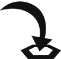 "**Jump**" is an added effect of a move ability. Jumping allows a figure to ignore all enemies, obstacles, objectives, and hazards, except for in the last hex.
Difficult terrain is ignored completely when jumping.

#### Flying

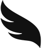 "**Flying**" is an active bonus (see [p.21](#page_21)). Flying allows a figure to completely ignore all enemies, obstacles, objectives, and hazards, including in the last hex. However, a flying figure still cannot end their movement in a hex occupied by another figure (and vice versa).

---

<a href="#page_1">🔝</a>&nbsp; &nbsp;<a name="page_18" class="page-number">18</a>

---

### Attack

 "**Attack X**" is a negative targeted ability that allows a figure to deal a base amount of X damage to an enemy within the specified range.

An attack with no specified range () value is considered a **melee attack** with range 1, capable of targeting adjacent enemies only, unless otherwise stated. An attack with any specified range () value is considered a **ranged attack**, regardless of the distance to the target.

An **attack** is a single attack performed against one target, an **attack ability** is an ability that consists of one or more separate attacks, and an **attack action** is any action that contains at least one attack ability.

#### Attack Modification Order

When an attack is performed, the base attack value written on the card can be modified in three different ways, which occur in the following order:

1. All applicable attack bonuses and penalties—such as "**±X** " effects, including poison (see [p.20](#page_20))—are applied.
1. An attack modifier is rolled and applied.
1. The target’s shield bonus is applied (see [p.22](#page_22)).

Once all modifications have been applied, the target suffers the resulting amount of damage. If the target has any abilities or effects which can negate a source of damage, including discarding or losing cards to negate damage (see [p.28](#page_28)), they may apply them now.

These steps are repeated for each individual target of the attack ability, which means it is possible for different targets to suffer different amounts of damage from the same attack ability.

> #### Attack Modifier Tables
> 
> Any time an attack ability is performed, **a separate attack modifier is rolled for each individual target of the attack ability** by rolling the die and consulting the attack modifier table. The rolled modifier is the modifier in the current row and the column matching the die roll (, , ). The rolled modifier is then applied to the attack, possibly reducing or increasing its value. Once the effects of a rolled modifier have been applied, move the modifier tracker cube down one row. (If you have difficulty remembering to move the cube after the attack, you can try moving the cube first and using the modifier from the row the cube moves to. If you do, the cube should start the scenario in the last slot instead of the first.)
> 
> Attack modifiers are only rolled for attacks. They are not used for any other type of effect that deals damage.
> 
> You have your own attack modifier table, while all monsters share a single table.
> 
> Each character class and all monsters start with a standard table of six , four 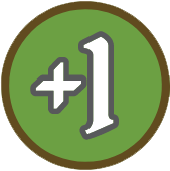, four 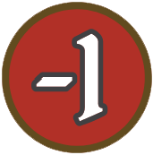, one 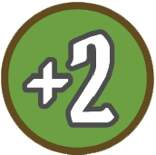, one 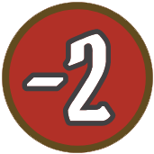, one 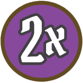, and one , but each character class table improves as the campaign progresses (see [p.35](#page_35)), allowing for other effects.
> 
> An attack modifier can have the following:

<quoteblock>
  <ol type="A">
    <li><strong>Modifier Value:</strong> This value modifies the attack value. The  modifier reduces the final attack value to zero. The  modifier doubles the current attack value.</li>
    <li><strong>Added Effects:</strong> Some modifiers have conditions (see <a href="#page_20">p.20</a>) or other added effects. When activated, these added effects function exactly as if written on the attack ability.</li>
  </ol>
</quoteblock>

---

<a href="#page_1">🔝</a>&nbsp; &nbsp;<a name="page_19" class="page-number">19</a>

---

#### Attack Effects

An attack effect is an effect attached to an attack. These effects are applied either during damage resolution or after the attack resolves. If applied after the attack resolves, the attack effect is still applied, even if the attack deals no damage (including due to a  modifier).

The attacker must choose whether to apply any attack effects before they roll an attack modifier. All attack effects except "**add** " are applied before any retaliate bonus (see [p.22](#page_22)). The "**add** " effect allows the attacker to perform additional attacks, and each attack must be resolved completely before another can be performed.

Some attacks have abilities (e.g., heal abilities) that aren’t attack effects but are still attached to the attack. These abilities are performed after the attack is resolved completely (including after any retaliate bonus).

Some modifiers have added effects, besides modifying the attack value, and **an attacking character can always choose** whether to apply those effects after the modifier is rolled.

#### Advantage and Disadvantage

> Some effects cause an attack to gain advantage or disadvantage. With **advantage**, the attacker rolls two modifiers on the same row and uses one of them. A monster always uses the better one (e.g.  over  or ;  over ), but you may use either one.
>
> With **disadvantage**, the attacker rolls two modifiers on the same row and always uses the worse one (e.g.  over  or ;  over ).

An attack cannot gain multiple instances of advantage or disadvantage. If an attack has both advantage and disadvantage, it is considered to have neither.

Any ranged attack on an adjacent enemy automatically gains disadvantage.

#### Pierce

 "**Pierce X**" is an added effect that reduces the target’s shield bonus (see [p.22](#page_22)) by X. Multiple " **X**" effects can be combined. For example, if an attack with " **2**" gains " **3**," the effect would reduce the target’s shield bonus by 5 for that attack.

---

<a href="#page_1">🔝</a>&nbsp; &nbsp;<a name="page_20" class="page-number">20</a>

---

### Conditions

A condition ability is a positive or negative targeted ability, depending on the specified condition, and causes the target of the ability to gain that condition.

When you gain a condition, place the matching token on your character card. When a monster gains a condition, place the matching token near its respective hit point dial. 

Once gained, a condition remains until the requirements for its removal are met. Neither positive nor negative conditions can be removed voluntarily. A figure cannot have multiple instances of the same condition; however, if a figure gains a condition they already have, the effect’s duration resets.

If a figure gains a condition during their turn that is removed "at the end of the figure’s next turn," the condition goes into effect immediately and applies until the end of their next turn. Conditions which are removed at the end of a figure’s turn are only removed after all other end-of-turn effects are resolved.

A condition effect can also be added to other abilities as an added effect, causing all targets of the ability to gain that condition after its main effect is resolved. If the ability is an attack, the target gains the condition even if the attack dealt no damage, but they do not gain the condition if the attack killed or exhausted them, or if they are immune.

#### Positive Conditions

 **Invisible:** The figure cannot be targeted by any enemy, though non-targeted abilities remain unaffected. The invisible figure and their allies can still interact with each other. Invisible is removed at the end of the figure’s next turn.

 **Strengthen:** The figure gains advantage on all of their attacks. Strengthen is removed at the end of the figure’s next turn.

#### Negative Conditions

 **Wound:** The figure suffers 1 damage at the start of each of their turns. Wound is removed when the figure is healed, and the figure is healed by the ability as normal. (You can place the token covering a monster’s ability text to help you remember.)

 **Poison:** All attacks targeting the figure gain "**+1** ." Poison is removed when the figure is healed but, unlike wound, poison prevents the heal from increasing the figure’s current hit point value. (You can place the token by your or the monster’s hit points to help you remember.)

 **Immobilize:** The figure cannot perform any move abilities. Immobilize is removed at the end of the figure’s next turn.

 **Disarm:** The figure cannot perform any attack abilities. Disarm is removed at the end of the figure’s next turn.

 **Muddle:** The figure gains disadvantage on all of their attacks. Muddle is removed at the end of the figure’s next turn.

---

<a href="#page_1">🔝</a>&nbsp; &nbsp;<a name="page_21" class="page-number">21</a>

---

### Heal

 "**Heal X**" is a positive targeted ability that allows the target to heal X amount of damage, increasing their current hit point value. When damage is healed, update the target’s hit point dial to reflect the new hit point total.

A figure’s current hit point value can never exceed their maximum hit point value, though it is permitted to target a figure that is already at their maximum hit point value with a heal ability; this can be done to remove poison or wound.

Heal effects from attack modifiers function exactly like heal abilities.

A single heal can remove any combination of wound and poison from a figure. However, if poison is present, the hit point increase is prevented.

### Active Bonuses

An active bonus ability is any ability that provides an active bonus to a figure or their allies. When a character performs an active bonus ability, the card is placed in their active area to track the bonus. Cards in a character’s active area are not considered to be in their hand.

> Active bonus abilities have icons to indicate the duration of the bonuses they provide. When a bonus expires, even if the action has other active bonus abilities, the card is removed from the character’s active area; an A-side card is flipped to its B-side and returned to your hand, a B-side card is placed in your discard pile, or the card is placed in your lost pile if the action has a lost icon (see [p.28](#page_28)).

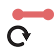 **Round Bonuses:** These bonuses activate when the ability is performed and expire at the end of the round.

 **Persistent Bonuses:** These bonuses activate when the ability is performed and expire when the specified removal condition has been fulfilled.

A character may voluntarily remove a card with a persistent bonus (but not a round bonus) from their active area before the bonus expires, but doing so removes the bonus. This can be done at any time except during another ability.

Actions with active bonus abilities might also have other abilities, but these other abilities are only performed when the card is played.
There is a wide variety of active bonus abilities. While these abilities are usually defined by text, there are two common ones with additional rules.

---

<a href="#page_1">🔝</a>&nbsp; &nbsp;<a name="page_22" class="page-number">22</a>

---

#### Shield

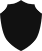 "**Shield X**" is a positive ability that gives the acting figure a shield bonus of X. This reduces the attack value of an incoming attack by X. The shield bonus is only applied after all attack bonuses or penalties and modifiers have been applied. Multiple shield bonuses stack with one another as a single reduction in attack value. A shield bonus does not apply to sources of damage that are not attacks and does not negate added effects.

A shield ability applies to the acting figure unless otherwise specified.

#### Retaliate

 "**Retaliate X**" is a positive ability that gives the acting figure a retaliate bonus of X. This deals X damage to any figure who attacks them, if they are within the specified range after all attack effects are resolved (including push or pull). If no range is specified, the bonus is only applied to adjacent attackers. This bonus is triggered by each attack and occurs after the attack is resolved.

> Some retaliate abilities include added effects, such as push or conditions. These effects are applied after the retaliate damage is applied.

A retaliate bonus is not an attack or targeted effect, therefore the damage cannot be reduced by a shield bonus. If a retaliating figure is killed or exhausted by an attack, the retaliate bonus does not occur. Multiple retaliate bonuses stack with one another as a single source of damage, but each retaliate bonus is only applied within its specified range.

A retaliate ability applies to the acting figure unless otherwise specified.

---

<a href="#page_1">🔝</a>&nbsp; &nbsp;<a name="page_23" class="page-number">23</a>

---

### Forced Movement

Forced movement is any negative targeted ability that allows a figure to control another figure’s movement. Forced movement must follow all normal movement rules for the target. For example, if a flying figure is forced to move, flying still applies.

There are two primary forced movement abilities:

 "**Push X**" forces the target to move up to X hexes away from the acting figure. Each individual hex entered must place the target farther by range from the acting figure.

 "**Pull X**" forces the target to move up to X hexes toward the acting figure. Each individual hex entered must place the target closer by range to the acting figure.

When you perform a push or a pull, you decide the direction and distance that the target moves. When you push or pull the target into a hazard hex, it suffers the effects of that hazard hex unless it’s flying.

When a monster performs a push or a pull, you decide the direction, but the target must move as far as possible. Push and pull are unaffected by difficult terrain, but all other normal movement rules are still applied (including the rules for flying figures). Immobilized figures can still be affected by push and pull.

Push and pull can also be added to other abilities as an added effect, allowing the forced movement of one or more targets of that ability after its main effect is resolved. If the ability is an attack, the target can be forced to move even if the attack dealt no damage, but they cannot be forced to move if the attack killed or exhausted them.

Multiple push or pull effects are combined. For example, if an ability with " **1**" gains " **2**," the result is a " **3**" ability.

---

<a href="#page_1">🔝</a>&nbsp; &nbsp;<a name="page_24" class="page-number">24</a>

---

### Control

**Control** allows you to force a monster to perform one or more abilities. You decide how the ability is performed. During this ability, the controlled figure treats your enemies as their enemies.

When a controlled move ability is performed, it is considered forced movement. A move ability cannot be controlled if the controlled figure has no valid path or is immobilized.

When a controlled attack ability is performed, the controlled figure uses their own attack modifier table. An attack ability cannot be controlled if the controlled figure has no valid targets or is disarmed.

A figure can be controlled to perform an " **X**" or " **X**" ability, even if they have no attack or move ability in their rolled action for the round. A controlled figure retains all of their persistent bonuses and special traits. A controlled ability is not considered a separate turn.

### Suffer Damage

Some abilities cause figures to suffer damage without an attack being performed. This damage is not modified by anything. Suffering damage is not a targeted ability.

### Recover

 **Recover** is a positive, non-targeted ability that allows you to recover discarded, flipped, or lost ability cards (see p.28). You look through your hand, discard pile, or lost pile, select cards up to the number specified by the ability, and return those cards to your hand on their A-side.

---

<a href="#page_1">🔝</a>&nbsp; &nbsp;<a name="page_25" class="page-number">25</a>

---

## Character Turns

On your turn, unless performing a long rest (see [p.27](#page_27)), you will perform the top action of one of your played ability cards and the bottom action of the other. You cannot perform two top actions or two bottom actions. You can perform either action first; which card was selected for your initiative no longer matters.

Once played, A-side ability cards are flipped to their B-side and returned to your hand instead of being discarded, but B-side cards are discarded. Ability cards are placed around the sides of the character card: discarded ability cards to the left, lost ability cards to the right, and active ability cards above the character card. Cards in your hand must be kept separate.

### Ability Cards

Ability cards, which are all unique, determine which actions you can perform.

An ability card has the following:

<ol type="A">
  <li><strong>Side Indicator:</strong> Indicates whether you’re looking at the A-side or B-side of the card.</li>
  <li><strong>Card Name:</strong> The name of the card.</li>
  <li><strong>Level:</strong> The level of the card, either a base level 1 or upgraded level 2 (see <a href="#page_35">p.35</a>).</li>
  <li><strong>Initiative Value:</strong> This value determines when you act during the round (see <a href="#page_11">p.11</a>).</li>
  <li><strong>Actions:</strong> Each card has a top action and a bottom action. The abilities of an action are performed from top to bottom, with each ability separated by an ability line.</li>
  <li><ol type="a">
    <li>An action might include an active ability icon (see <a href="#page_21">p.21</a>), in which case the card is placed in your active area.</li>
    <li>An action might include a lost icon (see <a href="#page_28">p.28</a>), in which case the card is placed in the lost pile after its action is performed.</li>
  </ol></li>
  <li><strong>Basic Action Icons:</strong> An ability card can always be used for a basic " **2**" top action or " **2**" bottom action. If a card is used this way, the card is flipped and returned to your hand (if it was on the A-side) or discarded (if it was on the B-side) as if it has no other icons.</li>
</ol>

---

<a href="#page_1">🔝</a>&nbsp; &nbsp;<a name="page_26" class="page-number">26</a>

---

### Items

Each scenario card includes two item entries, shown above and below the scenario entry. Items offer a wide variety of bonuses and extra abilities that can be used in addition to your normal two actions per round.

An item entry has the following:

<ol type="A">
  <li><strong>Item Name:</strong> The name of the item.</li>
  <li><strong>Item Effect:</strong> When the item can be used and what bonus or ability you gain.</li>
  <li><strong>Item Usage:</strong> What happens to the item after it has been used (see <a href="#page_26">p.26</a>). Some items are only spent, while others are lost. Some items can even be used multiple times.</li>
  <li><strong>Item Type:</strong> Each item counts as one of three types: , , or . These types determine which items you can bring into a scenario.</li>
</ol>

#### Item Limits

All items you bring into a scenario are placed below your character card and can be used as specified in the item entry.

You can use any item as long as it is available, but you can only bring a limited number of items into a scenario. You can bring up to two  items or one  item, and a number of  items up to half the scenario level (rounded up).

#### Item Usage

 **Spent Icon:** The spent icon means the item is spent after use. This is indicated by rotating the card sideways. Spent items can be recovered the next time you perform a long rest (see [p.27](#page_27)).

 **Lost Icon:** The lost icon means the item is lost after use. This is indicated by returning the card to the pile of unused items. Lost items cannot be used again for the rest of the scenario.

Some items do not have either of these icons. This means the item applies a passive effect. There are no limits on how many times an item with a passive effect can be used.

---

<a href="#page_1">🔝</a>&nbsp; &nbsp;<a name="page_27" class="page-number">27</a>

---

### Mandatory Triggers

Mandatory triggers are effects or abilities which cannot be skipped if any part of the action is performed. In such cases, the ability or effect is highlighted in a box with an "!" in front of it. These include:
- **Negative Abilities:** The indicated ability creates a negative effect for you.
- **Lost Icons:** The card must be lost.
- **Active Icons:** The card must be placed in your active area.

### Resting

Resting is the main way to retrieve cards from your discard pile. You have two options: a short rest or a long rest. In both cases, the rest can only be performed if you have at least two cards in your hand and/or discard pile. Resting always results in losing one card.

During the End of Round step (see [p.33](#page_33)), you may perform a short rest. When you short rest, return all cards from your discard pile to your hand and flip all B-side cards in your hand to their A-side, then lose one card at random from your hand. If you would like to keep the card that was lost, you can suffer 1 damage to lose a different random card instead, but this can only be done once per short rest.

During the Card Selection step (see [p.10](#page_10)), you may declare a long rest. This constitutes your entire turn for the round (instead of playing two cards) and it is performed on initiative 99. When you long rest, you follow these steps:
1. Return all cards from your discard pile to your hand and flip all B-side cards in your hand to their A-side, then lose one card of your choice from your hand (mandatory).
1. Perform "**Heal 2, self**" (optional).
1. Recover all of your spent items (optional). Items can be used during the same turn in which they are recovered.

---

<a href="#page_1">🔝</a>&nbsp; &nbsp;<a name="page_28" class="page-number">28</a>

---

### Lost Actions

 Lost actions can be performed only once. If an action has the lost icon, the card must be placed in your lost pile after the action is performed (in whole, or in part), where it will remain until the end of the scenario (unless recovered).

If the lost action was used to perform an active bonus ability, the card is still considered lost and must be moved from the active area to the lost pile once the active bonus is no longer in effect.

Some lost actions have the  icon. If you perform a lost action with this icon, the card cannot be recovered by any means until the end of the scenario. Place the card in the lost pile, but rotate it 180 degrees so that it is upside down as a reminder.

### Character Damage

When you would suffer any amount of damage, you must either reduce your hit point dial by that amount or negate the damage. Damage can be negated in two ways:
- **Ability or Effect:** You may use an active ability or effect which negates damage.

> - **Card Loss:** You may negate damage by discarding or losing cards in one of three ways:
>   - **Discard** one A-side card of your choice from your **hand**.
>   - **Discard** two B-side cards of your choice from your **hand**.
>   - **Lose** one card of your choice from your **discard pile**.

If you have not yet taken your turn, the cards you selected during the Card Selection step are not in your hand or discard pile and therefore cannot be discarded or lost to negate the damage.

Even if the damage is negated, effects or conditions from the source of damage are still applied.

### Exhaustion

You can become exhausted in two ways:
- **No Hit Points:** If you reach zero on your hit point dial.
- **No Cards:** If you do not have at least two cards in your hand (to play) or at least two cards in your hand and discard pile (to rest) at the start of a round.

If you become exhausted, you lose the scenario.

---

<a href="#page_1">🔝</a>&nbsp; &nbsp;<a name="page_29" class="page-number">29</a>

---

## Monster Turns

On a monster’s turn, it performs abilities based on the rolled action for its monster type. Monster abilities are automated, following specific guidelines, so that very few decisions about monster behavior need to be made by you.

### Monster Cards

> Each monster type appears on one side of a double-sided monster card, which determines its stats and abilities.

A monster card can have the following:

<ol type="A">
  <li><strong>Monster Name:</strong> The name of the monster type.</li>
  <li><strong>Hit Point Value:</strong> This is the total amount of damage that a monster of this type can suffer before it dies.</li>
  <li><strong>Attack Effects:</strong> These effects apply to all attack abilities performed by monsters of this type.</li>
  <li><strong>Persistent Bonuses:</strong> These are active bonuses that all monsters of this type have for the entire scenario.</li>
  <li><strong>Condition Immunities:</strong> These are conditions that a monster of this type is prevented from gaining due to immunity.</li>
  <li><strong>Action Columns:</strong> Each monster type has a set of three action columns. After you have selected your ability cards for the round, an action is rolled for each monster type with at least one figure currently on the map. This action determines when and how the monsters of that type will act during the round. The abilities of an action are performed from top to bottom, with each ability separated by an ability line. Each action column has the following:</li>
  <li><ol type="a">
    <li><strong>Initiative Value:</strong> This value determines when the monsters of this type act during the round.</li>
    <li><strong>List of Abilities:</strong> This list indicates which abilities the monsters of this type perform on their turns, if possible, and in what order.</li>
  </ol></li>
</ol>

**Each monster performs only the abilities listed on the action rolled for its monster type for the current round.** For example, if their rolled action does not list a move ability, they will not move. If their rolled action does not list an attack ability, they will not attack.

---

<a href="#page_1">🔝</a>&nbsp; &nbsp;<a name="page_30" class="page-number">30</a>

---

### Monster Acting Order

All monsters of each type act based on the initiative value rolled for their type for the current round. During their position in the initiative order, all monsters of a type act in ascending numeric order. Each monster completes its turn before the next monster acts.

### Focus

> Because Buttons & Bugs is a solo game, you are the sole focus of the monsters. They will target you with all attacks and negative targeted abilities.

For a melee attack, the monster identifies the shortest possible path to a hex from which it can perform the attack. For a ranged attack, the monster identifies the shortest possible path to a hex from which it can perform the ranged attack within the specified range. If the monster cannot attack on its turn, either because it does not have an attack ability or because it is disarmed, it moves as if for a single-target melee attack.

Determining the shortest possible path takes into consideration the effects of difficult terrain.

#### Path Priority

Monsters always prioritize a path that includes the fewest hazards, even when that means not maximizing targets. Monsters only path through hazards when there is no other viable path to attack an enemy. For example, if a monster could attack by moving two hexes through a hazard hex or by moving 10 hexes and avoiding the hazard, it would take the 10-hex path. It does not matter whether the monster can actually reach the end of the path on its current turn.

#### No Focus

If you are invisible or if the monster cannot reach a valid hex, given infinite movement, from which it can perform its attack, the monster does not move or attack but still performs any other abilities listed on its ability card.

---

<a href="#page_1">🔝</a>&nbsp; &nbsp;<a name="page_31" class="page-number">31</a>

---

### Monster Movement

Once a monster has identified its path to an attack hex, it then performs the abilities listed on its ability card in order — the first of which is usually its movement. A monster only moves on its turn if " **X**" is listed in its rolled action.

A monster always uses the fewest movement points required to maximize its attacks for its current turn. If a monster cannot attack on its current turn, it only moves if it can shorten the path to its attack hex. If an adjacent monster is performing a ranged attack, it will first move away so it doesn’t have disadvantage, if able. 

Having abilities other than  listed on its ability card does not affect a monster’s movement in any way. It will simply move according to the above rules and then perform its other abilities as fully as possible.

### Monster Attacks

A monster only attacks on its turn if " **X**" is listed in its rolled actions. The range of the attack is specified on the ability. If no range is specified, it is a melee attack.

### Other Monster Abilities

- **Active Bonuses:** Persistent bonuses on the monster card are active at all times. Round bonuses from rolled actions are only active once the monster has taken its turn, but they remain active until the end of the round. Multiple active bonuses stack with one another as a single effect.
- **Heal Abilities:** The monster heals itself or an ally within the specified range. It always targets the monster within range that has the greatest difference between its current and maximum hit point values.
- **Negative Targeted Abilities:** These are targeted in the same way as attack abilities, but will not affect how the monster moves.
- **Positive Conditions:** The monster applies the condition to itself or an ally within the specified range. It always targets the monster at the closest range that does not already have the condition. If there is a tie for closest range, it targets the monster that acts earliest in the initiative order.

---

<a href="#page_1">🔝</a>&nbsp; &nbsp;<a name="page_32" class="page-number">32</a>

---

### Monsters and Elements

Monsters can infuse and consume elements.

An infusion occurs immediately when the action is rolled. A monster consumes an element only when performing an ability that benefits from consuming the element. When the first monster of a type consumes an element, that consumption benefits every monster of that type.

If a monster consumes a wild or mixed element, you decide which infusion is consumed.

### Spawning Monsters

If the scenario rules indicate that monsters spawn in specific locations at specific times, add them to the map when specified. If a specified location is not empty, place the monster in the closest empty hex instead.

Spawned monsters act during the same round in which they were added to the map. If a newly added monster type does not have rolled action for the current round, roll one now.

Check the initiative value for each added monster. If their initiative value comes after the acting figure’s initiative value, they will act in normal initiative order. If their initiative value comes before the acting figure’s initiative value, they will act next. When multiple new monster types would act next, they act based on initiative values.

### Monster Damage and Death

Each monster’s hit points are tracked using the monster hit point dial that corresponds to the color of the cube that represents it on the map.

When a monster suffers damage, reduce its hit point dial by that amount. As soon as the monster has zero hit points, it dies.

When a monster dies, remove its cube from the map and clear all conditions from its monster tray.

No attack effects can be applied to a monster after it dies. If a monster dies while performing one of its own abilities, it cannot perform any other abilities.

---

<a href="#page_1">🔝</a>&nbsp; &nbsp;<a name="page_33" class="page-number">33</a>

---

## End of Round

After all figures on the map have taken a turn, the End of Round step begins. Perform the following operations in order:
1. Trigger any end-of-round effects in the scenario rules or on items or ability cards.
1. For ability cards in the active area with round bonuses:
  - A-side card: flip it to its B-side and return it to your hand
  - B-side card: place it in your discard pile 
  - If the card has a lost icon, place it in your lost pile
1. If you have at least two cards in your hand and/or discard pile, you may perform a short rest (see [p.27](#page_27)).

### Tracking Rounds

If a scenario has effects that occur at specific times, the rounds can be tracked using a spare monster hit point dial. Advance the round dial by one at the end of each round.

---

<a href="#page_1">🔝</a>&nbsp; &nbsp;<a name="page_34" class="page-number">34</a>

---

# Ending a Scenario

When a scenario ends, it is either lost or completed, depending on whether the scenario goal is met. The scenario is lost if you become exhausted or some other loss condition listed in the scenario rules occurs. The scenario is completed if the specific goal listed in the scenario rules is achieved.

Once the end of the scenario is triggered, play continues until the current round is over, and then the scenario ends. If the scenario would be both lost and completed in the same round, the scenario is lost.

You recover all of your discarded and lost ability cards, recover all of your spent and lost items, and reset your hit point dial to your maximum hit point value. All conditions are removed.

## Lost Scenario

If the scenario was lost, you must attempt the scenario again.

## Completed Scenario

If the scenario was completed, read the conclusion of the scenario, which is found in the scenario entry on the scenario card. The conclusion will indicate which scenario to play next in the campaign.

---

<a href="#page_1">🔝</a>&nbsp; &nbsp;<a name="page_35" class="page-number">35</a>

---

> # The Adventure Begins
> 
> At this point, you should be ready to start your adventure. Flip over the cover card of the scenario deck, read the story text on the back, then begin the journey with Scenario 1. The following rules will be helpful at the end of Scenario 1 and Scenario 2, when, respectively, items and leveling up are introduced.
> 
> ## Item Supply
> 
> There are two items printed at the top and bottom of each card in the scenario deck. Once Scenario 1 is complete, at the start of each scenario, the items on any card that has been resolved or skipped (all previous scenarios and the cover and collector cards) are available to equip. Only one item on each card can be equipped at one time, but different items can be equipped at the beginning of each scenario.
> 
> ## Character Progression
> 
> There is a level indicator to the right of the scenario's title, which determines the level of your character in the scenario. Your level determines four things:
> - How many level 1 ability cards you can upgrade (see below)
> - Which modifier table you should use (use the side of a card that matches the scenario level)
> - Your maximum hit point value (this is printed on your character mat as a red number below your indicated level)
> - How many  items you can equip (half your level, rounded up)
> 
> ### Upgraded Ability Cards
> 
> Each level 1 card you have can be upgraded for a specific level 2 card at the start of a scenario. For each additional scenario level after level 1, one card is upgraded to level 2. You decide which cards to upgrade for each scenario separately. 
> 
> A list of the ability cards and their respective upgrades is listed on the back of each character card.

---

<a href="#page_1">🔝</a>&nbsp; &nbsp;<a name="page_36" class="page-number">36</a>

---

# Appendix A: Component Inventory
- 1 Learn to Play book
- 6 Character cards
- 48 Ability cards
- 14 Modifier cards
- 10 Monster cards
- 22 Scenario cards
- 1 Icon Reference card
- 2 Modifier trays
- 4 Monster trays
- 5 Hit Point dials
- 30 Condition tokens
- 6 Plastic Character miniatures
- 10 Plastic cubes
- 1 Custom die

**Missing parts?** If you discover that you are missing any parts from your game, you can request replacements at [cephalofair.com/contact](https://cephalofair.com/contact).

---

<a href="#page_1">🔝</a>&nbsp; &nbsp;<a name="page_37" class="page-number">37</a>

---

# Appendix B: Monster Turn Guide

## 1. Initial Check

1. Check for Conditions and Attack Ability
  - Any monster with  or without an attack ability moves as if for a single-target melee attack but does not perform an attack.
  - Any monster with  ignores all move abilities but performs any other viable actions.
1. Check for Movement Paths 
  - Check for movement paths to attack hexes (i.e., hexes from which an attack can be performed). If no path exists (due to obstacles or other figures), the monster will not move or attack.

## 2. Find Path

The monster finds a path to an attack hex with the following priority list:
1. The path with the fewest hazards.
1. The path that requires the fewest movement points.

## 3. Perform Monster Abilities

Each monster performs all of its abilities from top to bottom (move, attack, and other abilities), fully resolving each ability before starting the next. For move abilities, observe the following rules:
- The monster must end its movement with a shorter path to its attack hex than it had before or it will not move.
- The monster chooses a movement path that triggers the fewest negative hexes.
- The monster moves toward a hex from which it can attack.
- If the monster could move to multiple hexes that maximize the previous priorities, it moves to the hex that requires the fewest movement points.
- In cases where monster movement is still ambiguous, you decide.

---

<a href="#page_1">🔝</a>&nbsp; &nbsp;<a name="page_38" class="page-number">38</a>

---

# Appendix C: Important Reminders

### Attacks and Damage

- A separate attack modifier is rolled for each target of an attack ability.
- A shield bonus only reduces damage from attacks, not from other sources, but the bonus applies to all incoming attacks while active.
- Even if an attack deals no damage (e.g., when a  modifier is rolled), all added effects of the attack are still applied.

> - You may negate all damage from one source by discarding or losing cards in one of three ways:
>   - **Discard** one A-side card of your choice from your **hand**.
>   - **Discard** two B-side cards of your choice from your **hand**.
>   - **Lose** one card of your choice from your **discard pile**.

### Monsters

- Each round, an action is rolled for each type of monster on the map. All monsters of a single type will use the same rolled action.
- A monster only performs the abilities listed on its rolled action for the round.
- A monster does not apply any active bonuses from its rolled action until its turn.
- If a monster cannot find an attack hex, it will not move.
- If a monster will not be performing an attack on its turn or is disarmed, it moves as if for a single-target melee attack.

### Character

> - You initially use the base modifier table on the modifier tray. Advanced attack modifier tables are used during higher level scenarios.

- You cannot perform two top actions or two bottom actions.
- For the basic actions, " **2**" is always a top action, and " **2**" is always a bottom action.

### Elements

> - Infused elements are available as soon as their icon is visible on a chosen ability card, an ability card in your hand or active area, or on a rolled monster action.
> - An infused element is immediately unavailable if the ability card it is visible on is flipped, discarded, or lost. An infused element visible on a rolled monster action is no longer available as soon as all monsters of that type are killed.

### Scenario Details

> - The scenario level is listed in the scenario entry and determines the number of level 2 ability cards and items you can select.
> - You can upgrade one ability card for each level beyond the first.

- You can each equip a number of  items equal to half the scenario level (rounded up).
- The end of a scenario can only occur at the end of a round, even if the objective is met mid-round.

---

<a href="#page_1">🔝</a>&nbsp; &nbsp;<a name="page_39" class="page-number">39</a>

---

# Appendix D: Item Index

| Item                      | Type | Scen. | Use | Effect |
| :---                      |:---: | :---: |:---:| :---   |
| Venomous Fang	            |  |	 1	|  |	During your melee attack, add .	 |
| Rosethorn Knife	          |  |	 1	|                                                                 |	During your attack,  to add  1.	 |
| Button Shield	            |  |	 3	|  |	During an enemy's attack, gain  1.	 |
| Spring Hammer	            |    |	 3	|  |	During your melee attack, add  2.	 |
| Tanglevine Whip	          |  |	 4	|                                                                 |	During your attack,  to add .	 |
| Iron Nail	                |    |	 4	|  |	During your turn, add  2 to all your melee attacks.	 |
| Chestnut Shell Shield	    |  |	 8	|  |	During an enemy's attack, gain  1,  1.	 |
| Fishing Hook and Line	    |    |	 8	|  |	During your ranged attack, add  2,  2.	 |
| Sewing Needles	          |  |	11	|  |	During your attack, add  1.	 |
| Coin Shield	              |  |	12	|  |	During an enemy's attack, gain  2.	 |
| Sharpened Pencil	        |    |	12	|  |	During your single-target melee attack, add: 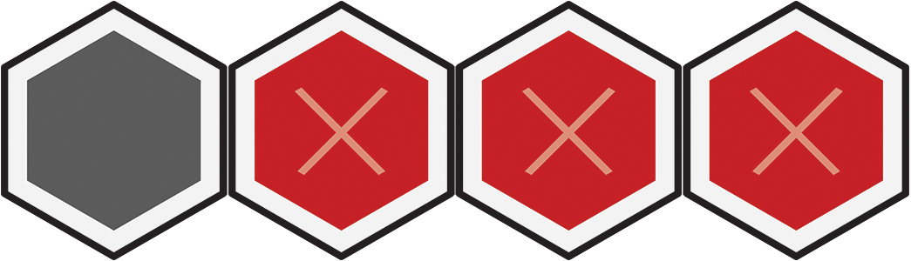	 |
| Shrunken Longsword	      |  |	13	|  |	During your melee attack, add +1 .	 |
| Shrunken Longbow	        |    |	13	|  |	During your ranged attack, add +1 ,  1.	 |
| Playing Card Shield	      |    |	15	|  |	During an enemy's attack, gain  4.	 |
| Glass Shard	              |  |	15	|  |	During your melee attack, add .	 |
| Pocket Knife	            |    |	19	|  |	During your melee attack, add +1 ,  2, .	 |
| Iridescent Shell Shield	  |  |	19	|  |	During your turn, gain  1 for the round. Create .	 |

| Item                      | Type | Scen. | Use | Effect |
| :---                      |:---: | :---: |:---:| :---   |
| Sparrow Skull Helm	      |  |	 1	|  |	During your attack, gain advantage.	 |
| Bottle Cap Helm	          |  |	 1	|  |	During an enemy's attack, treat its  attack modifier as a  attack modifier.	 |
| Old Spring                |  |	 1	|  |	During your turn, add  to all your movement.	 |
| Shrunken Weathered Boots  |  |	 1	|  |	During your movement, add +1 .	 |
| Drop of Clean Water       |  |	 2	|                                                                 |	During your turn,  to remove one negative condition.	 |
| Drop of Power Potion	    |  |	 2	|      |	During your turn, add +1  to all your attacks.	 |
| Leftover Table Scraps	    |  |	 5	|  |	During your turn,  1 self.	 |
| Magnetic Needle	          |  |	 5	|      |	During your turn, control one enemy within  5:  2.	 |
| Nightshade Pollen	        |  |	 6	|                                                                 |	After an enemy's attack,  to  that enemy.	 |
| Robin's Feather Arrows	  |  |	 6	|                                                                 |	During your single-target ranged attack,  to add +1 ,  1.	 |
| Volatile Powder	          |  |	 7	|      |	During your single-target ranged attack, add: 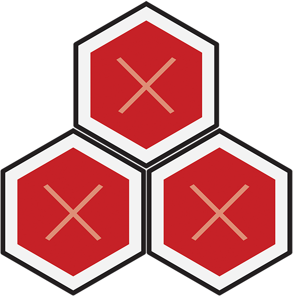	 |
| Drop of Healing Potion	  |  |	 7	|      |	During your turn,  3 self.	 |
| Lubricating Oil	          |  |	 9	|  |	During your movement, add +2 .	 |
| Brass Cog	                |  |	 9	|  |	After determining initiative, increase or decrease your initiative by 10.	 |
| Drop of Stamina Potion	  |  |	10	|      |	During your turn,  one level 1 card from your hand or discard pile to its A-side.	 |
| Drop of Element Potion	  |  |	10	|      |	During your turn, create .	 |
| Pinch of Doom Powder	    |  |	11	|      |	During your attack, add , .	 |
| Lucky Cat's-Eye Marble	  |  |	14	|  |	During your attack, treat your  attack modifier as a  attack modifier.	 |
| Embernettle	              |  |	14	|                                                                 |	During an enemy's attack,  to  that enemy.	 |
| Drop of Stamina Elixir	  |  |	16	|      |	During your turn,  one card from your hand or discard pile to its A-side.	 |
| Drop of Haste Elixir	    |  |	16	|      |	After performing the top action of an ability card, also perform its bottom action.	 |
| Drop of Strength Potion	  |  |	17	|      |	During your turn,  self.	 |
| Prismatic Gem	            |  |	17	|  |	During your attack,  to add +1 .	 |
| Brightlure Gem	          |  |	18	|                                                                 |	After your attack,  to control the target of the attack:  1.	 |
| Duskhaze Gem	            |  |	18	|                                                                 |	During an enemy's attack,  to gain  1 and  that enemy.	 |

---

<a href="#page_1">🔝</a>&nbsp; &nbsp;<a name="page_40" class="page-number">40</a>

---

# Appendix E: Index

### A

Ability xx, xx–xx, xx

---

<a href="#page_1">🔝</a>&nbsp; &nbsp;<a name="page_41" class="page-number">41</a>

---

# Credits

Inspired by *Gloomholdin*

## Design and Development

### Designers

Joe Klipfel and Nikki Valens

### Developer and Project Manager

Nikki Valens

### Scenario 20 Design

Misty Burgess

## Illustration

### Cover, Character, and Monster Artist

Mofei Wang

### Map Artist

Yannis Cardin

### Art Directors

BJ Hensley and Arch Anderson

## 3D Modeling

### Miniature Sculptors

Chris Lewis

## Graphic Design

### Lead Graphic Designer

Arch Anderson

### Graphic Designer

Jason D. Kingsley

### Learn to Play Layout Artist

Jason D. Kingsley

## Writing

### Narrative Writer

Isaac Childres

### Technical Writers

Nikki Valens, Isaac Childres, Jason D. Kingsley

### Editor

Jaym Gates

## Production

### Executive Producer and Production Lead

Price Johnson

## Playtesting

### Playtest Coordinator

Nikki Valens

### Campaign Playtesters

Amr Ammourazz, Calvin Wong Tze Loon 黃子倫, David Gregg, Duncan Henry, Fiona van den Heiligenberg, Hong Di-Anne, Joseph Bozarth, Kyle Kemp, Larry, Braden, and Maks Marburger, Misty Burgess, Rachel Woodfint, Z Svela

### Additional Playtesters

Alexander Norback, Alisandra Livingston, Andrew Brown, Ben Donovan, Brook Laing, Carl Skelton, Clay Kramer, Conrad Gregory Oakes, Corbin Neuhauser, Dan Sawade, Daniel J Burras, David Hodd, David Ross Pascoe, John Morgan, Joshua Ryan Jones, Joshua Trotta, Julian Naydichev, Julie Lauzon, Kelly Nulty, Mike Clemson, Mike Clinton, Nathan Moteberg, Nicole Koprince, Peter Koprince, Ragnar Sigurður Ragnarsson, Ryan Huntley, Samuel Muriello, Sean Lim

## Crowdfunding

### Marketing and Crowdfunding Manager

Ross Thompson

### Twitch Producer

Ruel Gaviola

### BackerKit

## Special Thanks

“Thank you to my wife, Krista, who tirelessly supports my game design shenanigans.” —Joe Klipfel

---

<a href="#page_1">🔝</a>&nbsp; &nbsp;<a name="page_42" class="page-number">42</a>

---

# Quick Reference

### Beginning a Scenario ([p.7](#page_7))

1. Select a scenario.
1. Read the scenario entry.
1. Retrieve all monsters for the scenario.
1. Resolve scenario effects and flip to the map side.
1. Place monster cards in their respective trays.
1. Place monster cubes and character mini.
1. Set character level and monster difficulty.
1. Place conditions nearby.
1. Select which items to bring.
1. Select upgraded ability cards.
1. Set all hit point values to maximum.
1. Apply any remaining scenario effects.

### Scenario Phase ([p.6](#page_6))

1. Start of Round Effects
1. Card Selection
1. Ordering of Initiative
1. Character and Monster Turns
1. End of Round

### Targeted Abilities ([p.13](#page_13))

- Attack ([p.18](#page_18))
- Conditions ([p.20](#page_20))
- Heal ([p.21](#page_21))
- Forced Movement ([p.23](#page_23))
- Controlling Monsters ([p.24](#page_24))

### Attack Modification Order ([p.18](#page_18))

1. Apply all attack bonuses and penalties.
1. Roll and apply an attack modifier card.
1. Apply the target's shield bonus.

### End of Round ([p.33](#page_33))

1. Trigger any end-of-round effects.
1. Remove all round bonuses from your active area.
1. Perform a short rest if desired.

### Ending a Scenario ([p.34](#page_34))

#### Whether the Scenario was Lost or Completed:

- Recover all discarded and lost items and ability cards.
- Reset character health dial to maximum.
- Remove all conditions.

#### If the Scenario was Lost:

- Replay the scenario.

#### If the Scenario was Completed:

- Read the scenario conclusion.
- Scenario indicates which scenario to play next.

### Timing of Attack Effects

- +X Attack ([p.18](#page_18)) – during damage resolution
- Pierce ([p.19](#page_19)) – during damage resolution
- +X Target ([p.13](#page_13)) – after the attack resolves
- Conditions ([p.20](#page_20)) – after the attack resolves
- Forced Movement ([p.23](#page_23)) – after the attack resolves
- Other Added Effects ([p.19](#page_19)) – after the attack resolves

### Scenario Level ([p.8](#page_8))

|	Scenario Level	          |	1	|	2	|	3	|	4	|	5	|
| :---                      |:---:|:---:|:---:|:---:|:---:|
|	Upgraded Ability Cards	  |	0	|	1	|	2	|	3	|	4	|
|	Character Modifier Level	|	1	|	2	|	3	|	4	|	5	|
|	Items	                    |	1	|	1	|	2	|	2	|	3	|

- The monster modifier difficulty remains at “standard” throughout the entire campaign, but this difficulty can be increased or decreased to affect monster difficulty as desired.

