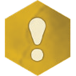

<link rel="stylesheet" href="override-markdown-styles.css"/>

---

<a name="page_1" class="page-number">1</a>

---

This light weight rules resource for *Gloomhaven: Buttons & Bugs* is intended to be easy to access, search, and print. It is updated with any corrections and errata.

Last updated 11/09/2023

For more resources, visit [cephalofair.com/bnb](https://cephalofair.com/bnb)

© 2023 Cephalofair Games, LLC. All Rights Reserved.

---

<a href="#page_1">🔝</a>&nbsp; &nbsp;<a name="page_2" class="page-number">2</a>

---

# Table of Contents

<h3 id="getting-started-p3">Getting Started <a href="#page_3">p.3</a></h3>

<ul>
  <li>Choose a Character <a href="#page_4">p.4</a></li>
  <li>Learning the Rules <a href="#page_5">p.5</a></li>
</ul>

<h3 id="scenario-phase-p6">Scenario Phase <a href="#page_6">p.6</a></h3>

<h4 id="beginning-a-scenario-p7">Beginning a Scenario <a href="#page_7">p.7</a></h4>

<h4 id="scenario-cards-p8">Scenario Cards <a href="#page_8">p.8</a></h4>

<ul>
  <li>Terrain <a href="#page_9">p.9</a>
    <ul>
      <li>Obstacles <a href="#page_9">p.9</a></li>
      <li>Difficult Terrain <a href="#page_9">p.9</a></li>
      <li>Hazards <a href="#page_9">p.9</a></li>
      <li>Pressure Plates <a href="#page_9">p.9</a></li>
      <li>Objectives <a href="#page_9">p.9</a></li>
    </ul>
  </li>
</ul>

<h4 id="playing-a-scenario-p10">Playing a Scenario <a href="#page_10">p.10</a></h4>

<ol>
  <li>Start of Round Effects <a href="#page_10">p.10</a></li>
  <li>Card Selection <a href="#page_10">p.10</a></li>
  <li>Ordering of Initiative <a href="#page_11">p.11</a>
    <ul>
      <li>Resolving Ties <a href="#page_11">p.11</a></li>
      <li>Monster Order <a href="#page_11">p.11</a></li>
    </ul>
  </li>
  <li>Character and Monster Turns <a href="#page_12">p.12</a>
    <ul>
      <li>Actions and Abilities Overview <a href="#page_12">p.12</a>
        <ul>
          <li>Actions <a href="#page_12">p.12</a></li>
          <li>Abilities <a href="#page_12">p.12</a></li>
        </ul>
      </li>
      <li>Important Ability Concepts <a href="#page_13">p.13</a>
        <ul>
          <li>Target <a href="#page_13">p.13</a></li>
          <li>Allies, Enemies, and Self <a href="#page_13">p.13</a></li>
          <li>Range <a href="#page_14">p.14</a></li>
          <li>Area of Effect <a href="#page_14">p.14</a></li>
          <li>Added Effects <a href="#page_15">p.15</a></li>
          <li>Elements <a href="#page_16">p.16</a></li>
        </ul>
      </li>
      <li>Abilities <a href="#page_17">p.17</a>
        <ul>
          <li>Move <a href="#page_17">p.17</a>
            <ul>
              <li>Jump <a href="#page_17">p.17</a></li>
              <li>Flying <a href="#page_17">p.17</a></li>
            </ul>
          </li>
          <li>Attack <a href="#page_18">p.18</a>
            <ul>
              <li>Attack Modification Order <a href="#page_18">p.18</a></li>
              <li>Attack Modifier Tables <a href="#page_18">p.18</a></li>
              <li>Attack Effects <a href="#page_19">p.19</a></li>
              <li>Advantage and Disadvantage <a href="#page_19">p.19</a></li>
              <li>Pierce <a href="#page_19">p.19</a></li>
            </ul>
          </li>
          <li>Conditions <a href="#page_20">p.20</a>
            <ul>
              <li>Positive Conditions <a href="#page_20">p.20</a></li>
              <li>Negative Conditions <a href="#page_20">p.20</a></li>
            </ul>
          </li>
          <li>Heal <a href="#page_21">p.21</a></li>
          <li>Active Bonuses <a href="#page_21">p.21</a>
            <ul>
              <li>Shield <a href="#page_22">p.22</a></li>
              <li>Retaliate <a href="#page_22">p.22</a></li>
            </ul>
          </li>
          <li>Forced Movement <a href="#page_23">p.23</a></li>
          <li>Control <a href="#page_24">p.24</a></li>
          <li>Suffer Damage <a href="#page_24">p.24</a></li>
          <li>Recover <a href="#page_24">p.24</a></li>
        </ul>
      </li>
      <li>Character Turns <a href="#page_25">p.25</a>
        <ul>
          <li>Ability Cards <a href="#page_25">p.25</a></li>
          <li>Items <a href="#page_26">p.26</a>
            <ul>
              <li>Item Limits <a href="#page_26">p.26</a></li>
              <li>Item Usage <a href="#page_26">p.26</a></li>
            </ul>
          </li>
          <li>Mandatory Triggers <a href="#page_27">p.27</a></li>
          <li>Resting <a href="#page_27">p.27</a></li>
          <li>Lost Actions <a href="#page_28">p.28</a></li>
          <li>Character Damage <a href="#page_28">p.28</a></li>
          <li>Exhaustion <a href="#page_28">p.28</a></li>
        </ul>
      </li>
      <li>Monster Turns <a href="#page_29">p.29</a>
        <ul>
          <li>Monster Cards <a href="#page_29">p.29</a></li>
          <li>Monster Acting Order <a href="#page_30">p.30</a></li>
          <li>Focus <a href="#page_30">p.30</a>
            <ul>
              <li>Path Priority <a href="#page_30">p.30</a></li>
              <li>No Focus <a href="#page_30">p.30</a></li>
            </ul>
          </li>
          <li>Monster Movement <a href="#page_31">p.31</a></li>
          <li>Monster Attacks <a href="#page_31">p.31</a></li>
          <li>Other Monster Abilities <a href="#page_31">p.31</a></li>
          <li>Monsters and Elements <a href="#page_32">p.32</a></li>
          <li>Spawning Monsters <a href="#page_32">p.32</a></li>
          <li>Monster Damage and Death <a href="#page_32">p.32</a></li>
        </ul>
      </li>
      <li>End of Round <a href="#page_33">p.33</a>
        <ul>
          <li>Tracking Rounds <a href="#page_33">p.33</a></li>
        </ul>
      </li>
    </ul>
  </li>
</ol>

<h3 id="ending-a-scenario-p34">Ending a Scenario <a href="#page_34">p.34</a></h3>

<ul>
  <li>Lost Scenario <a href="#page_34">p.34</a></li>
  <li>Completed Scenario <a href="#page_34">p.34</a></li>
</ul>

<h3 id="the-adventure-begins-p35">The Adventure Begins <a href="#page_35">p.35</a></h3>

<ul>
  <li>Item Supplies <a href="#page_35">p.35</a></li>
  <li>Character Progression <a href="#page_35">p.35</a></li>
  <li>Upgraded Ability Cards <a href="#page_35">p.35</a></li>
</ul>

<h3 id="appendices">Appendices</h3>

<ul>
  <li>Appendix A: Component Inventory <a href="#page_36">p.36</a></li>
  <li>Appendix B: Monster Turn Guide <a href="#page_37">p.37</a></li>
  <li>Appendix C: Important Reminders <a href="#page_38">p.38</a></li>
  <li>Appendix D: Item Index <a href="#page_39">p.39</a></li>
  <li>Appendix E: Index <a href="#page_40">p.40</a></li>
</ul>

<h3 id="credits-p41">Credits <a href="#page_41">p.41</a></h3>

<h3 id="quick-reference-p42">Quick Reference <a href="#page_42">p.42</a></h3>

---

<a href="#page_1">🔝</a>&nbsp; &nbsp;<a name="page_3" class="page-number">3</a>

---

# Getting Started

Oh no! You have been shrunk by magic! To return to your former size, you’ll need to navigate this strange new world by playing through a series of scenarios that will lead you through the miniature world you now find yourself in. You may find a few friends along the way, but you’ll mostly meet a variety of enemies you will need to defeat in combat. Luckily, you are a capable mercenary with abilities, which are represented by cards. You’ll need to play the right cards at the right times to overcome the many threats that await you on your journey.

There are six character classes to choose from, each with their own unique abilities and play styles. You will also be able to customize your character as you progress through items and advanced ability cards.

This document will provide you with details on how to play the game, but if you played another Gloomhaven game, many of these rules will be familiar. We suggest reading all the way through anyways to get a full understanding of how the game works. Rules text highlighted in green is information unique to the Buttons & Bugs system and is different from Gloomhaven and Frosthaven.

---

<a href="#page_1">🔝</a>&nbsp; &nbsp;<a name="page_4" class="page-number">4</a>

---

## Choose a Character

Creating a character and starting your journey in Buttons & Bugs is a simple process: you just choose a character class and start playing.

You will need to gather the following components for your chosen character to play:

- **Character Card:** This card provides a visual representation of your character, along with your hit point values at different levels and a place to put condition tokens. On the back, you can find a short description of the character and a list of your ability cards and upgrades.
- **Character Mini:** This is a small plastic piece to represent your character.
- **Ability Cards:** There are four double-sided level 1 cards and four double-sided level 2 cards. The appropriate cards are listed on your character card.
- **Attack Modifier Tray (with white cube):** This is used to track your attack modifier table. At level 1, you will use the default table printed on the tray.
- **Advanced Attack Modifier Cards:** Two double-sided cards to upgrade your attack modifier table at later levels.
- **Character Hit Point Dial:** This is to track your hit points during a scenario.

---

<a href="#page_1">🔝</a>&nbsp; &nbsp;<a name="page_5" class="page-number">5</a>

---

## Learning the Rules

Now that you’ve chosen a character, it is time to learn the rules. If you would prefer to watch a video instead, you can find that here:

[cephalofair.com/bnb](https://cephalofair.com/bnb)

Most of the rules of this game focus on how you play through a scenario. Since this is intended to be a campaign game, where you play through a series of scenarios in order, there will be some explanation of how to do that after the basic rules.

---

<a href="#page_1">🔝</a>&nbsp; &nbsp;<a name="page_6" class="page-number">6</a>

---

# Scenario Phase

Scenarios are self-contained missions designed to be played in a single sitting. The scenario deck contains 20 scenarios, but you will not play through them all in a single campaign. Unlike other Gloomhaven games, the story of Buttons & Bugs is mostly linear.

Each Scenario Phase consists of three distinct steps:

- **Beginning a Scenario:** In this step, you will prepare everything needed for the scenario, including your own character, the monsters you will fight against, and the map layout where the fight will occur.
- **Playing a Scenario:** The scenario is played over a series of rounds. During each round, all figures on the map, both your character and the monsters, will take a turn. You will play through round after round until the scenario is lost or completed.
- **Ending a Scenario:** In this step, you will resolve the effects of losing or completing the scenario.

---

<a href="#page_1">🔝</a>&nbsp; &nbsp;<a name="page_7" class="page-number">7</a>

---

# Beginning a Scenario

Each time you play a scenario, you will prepare the scenario by performing the following steps in order:

1. Select a scenario to play and find the corresponding scenario card. **Note:** You can play any scenario, but for the best story experience, we suggest that you follow the conclusion text of each scenario.
1. Read the scenario introduction, special rules, and goal in the scenario entry and check the scenario level.
1. Retrieve the monster card for each monster type present in the scenario.
1. Resolve any scenario effects or note them to be resolved later in setup. Flip the scenario card to its map side.
1. Place each monster card in its own monster tray. For each tray, place one white cube on the tray’s “o” slot. Retrieve the monster hit point dial colored to correspond to each monster on the scenario map. 
1. Place uniquely colored cubes on the map to represent each monster in the scenario, matching the color shown on the scenario map. Place your character mini on the indicated starting space.
1. Retrieve both attack modifier trays. If the scenario is level 2 or higher, retrieve the appropriate level modifier card for your character and place it in the character modifier tray. You may select a monster difficulty other than “standard” by placing the chosen difficulty monster modifier card in the monster modifier tray.
1. Keep all condition tokens, the die, and the icon reference card nearby.
1. Decide which items to equip from the pool of available items (see p.26).
1. Retrieve your character’s level 1 ability cards and select a number of cards to upgrade equal to the scenario level minus one. Replace the selected level 1 ability cards with the corresponding level 2 ability cards (listed on the back of your character card). Your selected cards will start in your hand.
1. Set the character hit point dial to your character’s maximum hit point value, which is shown below the scenario level in the chart at the bottom of your character card. Set each monster’s corresponding colored hit point dial to their respective maximum hit points.
1. Apply any remaining scenario effects.

---

<a href="#page_1">🔝</a>&nbsp; &nbsp;<a name="page_8" class="page-number">8</a>

---

## Scenario Cards

Each card contains a scenario entry with everything you need to know to play through it. Most scenario entries contain the following information:

<ol type="A">
  <li>The scenario’s number, name, and level.</li>
  <li>The character required to play the scenario, if any.</li>
  <li>The narrative introduction to the scenario.</li>
  <li>The list of monsters that appear in the scenario.</li>
  <li>The goal of the scenario. When this is achieved, the scenario is completed, and the scenario conclusion should be read at the end of the current round.</li>
  <li>Any special rules for the scenario.</li>
  <li>The narrative conclusion to the scenario.</li>
  <li>The scenario or scenarios to be played next in the campaign.</li>
</ol>

The map side of each scenario card also displays the map details for the scenario. This includes the following information:

<ol type="A">
  <li><strong>Starting Hex:</strong> You place your miniature in this hex at the start of the scenario.</li>
  <li><strong>Terrain:</strong> These are hexes indicating additional map features (see p.9).</li>
  <li><strong>Monster Placements:</strong> These hexes show monster placements. Place each monster cube in the hex showing the corresponding cube color.</li>
  <li><strong>Notable Hexes:</strong> These hexes, marked by letters, are explained in the special rules of the scenario.</li>
</ol>

---

<a href="#page_1">🔝</a>&nbsp; &nbsp;<a name="page_9" class="page-number">9</a>

---

### Terrain

Each scenario map contains various types of terrain. The type of terrain is defined by the colored border of the tile, as depicted on the scenario map, not necessarily by the illustration of the hex.
A hex with no terrain outline is considered **featureless**. A hex with no figure is considered **unoccupied**. A hex that is both featureless and unoccupied is considered **empty**.

#### Obstacles

  
  
Figures cannot enter a hex with an obstacle, except when flying or jumping (unless the jump movement would end there). Range can be counted through obstacles, and obstacles do not block ranged attacks.

#### Difficult Terrain

  
  
A figure requires 2 movement points to enter a difficult terrain hex, except when flying or jumping (even if the jump movement ends there).

#### Hazards

  
  
If any figure enters a hazard hex, unless they are flying or jumping, some effect is applied to that figure. Hazard effects are varied and are specified by each individual hazard on the scenario map. Figures do not suffer additional effects when starting a turn in or exiting a hazard hex, but the effects are applied if you end a jump movement in a hazard hex. If a figure occupies a hex with an <strong>immobilize</strong>  hazard (see p.20), treat them as an obstacle when determining the movement of other figures.

#### Pressure Plates

  
  
A pressure plate’s trigger and all of its effects are defined in the special rules for the scenario. Pressure plates are considered empty hexes.

#### Objectives

  
  
An objective, when present, is important to the goal of a scenario; an objective is a physical object (such as a bell) which needs to be attacked or protected. Objectives can be targeted by attacks, but are immune to damage, all conditions, and forced movement. Objectives are otherwise considered to be and treated as obstacles. The special rules for the scenario will describe how the objective relates to the scenario’s goal.

